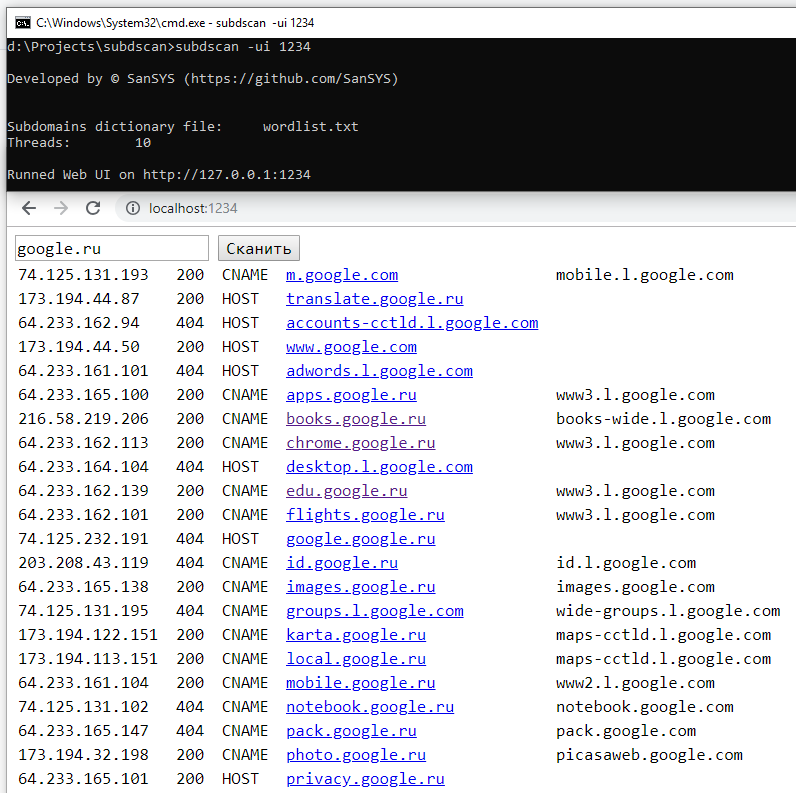

# subdscan
Subdomain fast search tool

## Usage
```
# params
-d string
      Set domain scan like '-d ya.ru'
-t int
      Set parallelism like '-t 50' (default 10)
-ui int
      Enable user interface on port '-ui 8080'
-w string
      Set subdomains dictionary file like '-w wordlist.txt' (default "wordlist.txt")
```

### run console
```bash
./subdscan -d somesite.ru
```


### run web ui
```bash
./subdscan -ui 1234
```


